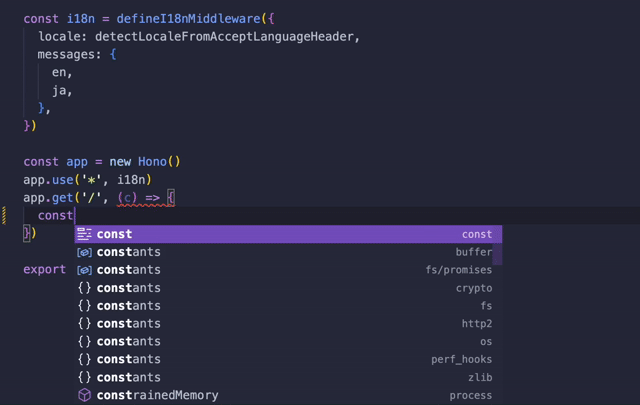

# @intlify/hono

[![npm version][npm-version-src]][npm-version-href]
[![npm downloads][npm-downloads-src]][npm-downloads-href]
[![CI][ci-src]][ci-href]

Internationalization middleware & utilities for [Hono](https://hono.dev/)

## 🌟 Features

✅️ &nbsp;**Translation:** Simple API like
[vue-i18n](https://vue-i18n.intlify.dev/)

✅ &nbsp;**Custom locale detector:** You can implement your own locale detector
on server-side

✅️️ &nbsp;**Useful utilities:** support internationalization composables
utilities via [@intlify/utils](https://github.com/intlify/utils)

## 💿 Installation

```sh
# Using npm
npm install @intlify/hono

# Using yarn
yarn add @intlify/hono

# Using pnpm
pnpm add @intlify/hono

# Using bun
bun add @intlify/hono
```

## 🚀 Usage

```ts
import { Hono } from 'hono'
import {
  defineI18nMiddleware,
  detectLocaleFromAcceptLanguageHeader,
  useTranslation,
} from '@intlify/hono'

// define middleware with vue-i18n like options
const i18nMiddleware = defineI18nMiddleware({
  // detect locale with `accept-language` header
  locale: detectLocaleFromAcceptLanguageHeader,
  // resource messages
  messages: {
    en: {
      hello: 'Hello {name}!',
    },
    ja: {
      hello: 'こんにちは、{name}！',
    },
  },
  // something options
  // ...
})

const app = new Hono()

// install middleware with `app.use`
app.use('*', i18nMiddleware)

app.get('/', c => {
  // use `useTranslation` in handler
  const t = useTranslation(c)
  return c.text(t('hello', { name: 'hono' }) + `\n`)
})

export default app
```

## 🛠️ Custom locale detection

You can detect locale with your custom logic from current `Context`.

example for detecting locale from url query:

```ts
import { defineI18nMiddleware, getQueryLocale } from '@intlify/hono'
import type { Context } from 'hono'

const DEFAULT_LOCALE = 'en'

// define custom locale detector
const localeDetector = (ctx: Context): string => {
  try {
    return getQueryLocale(ctx).toString()
  } catch () {
    return DEFAULT_LOCALE
  }
}

const middleware = defineI18nMiddleware({
  // set your custom locale detector
  locale: localeDetector,
  // something options
  // ...
})
```

## 🧩 Type-safe resources

> [!WARNING]  
> **This is experimental feature (inspired from [vue-i18n](https://vue-i18n.intlify.dev/guide/advanced/typescript.html#typescript-support)).**
> We would like to get feedback from you 🙂.

> [!NOTE]
> The exeample code is [here](https://github.com/intlify/hono/tree/main/playground/typesafe-schema)

You can support the type-safe resources with schema using TypeScript on `defineI18nMiddleware` options.

Locale messages resource:

```ts
export default {
  hello: 'hello, {name}!'
}
```

your application code:

```ts
import { defineI18nMiddleware } from '@intlify/hono'
import en from './locales/en.ts'

// define resource schema, as 'en' is master resource schema
type ResourceSchema = typeof en

const i18nMiddleware = defineI18nMiddleware<[ResourceSchema], 'en' | 'ja'>({
  messages: {
    en: { hello: 'Hello, {name}' },
  },
  // something options
  // ...
})

// someting your implementation code ...
// ...
```

Result of type checking with `tsc`:

```sh
npx tsc --noEmit
index.ts:13:3 - error TS2741: Property 'ja' is missing in type '{ en: { hello: string; }; }' but required in type '{ en: ResourceSchema; ja: ResourceSchema; }'.

13   messages: {
     ~~~~~~~~

  ../../node_modules/@intlify/core/node_modules/@intlify/core-base/dist/core-base.d.ts:125:5
    125     messages?: {
            ~~~~~~~~
    The expected type comes from property 'messages' which is declared here on type 'CoreOptions<string, { message: ResourceSchema; datetime: DateTimeFormat; number: NumberFormat; }, { messages: "en"; datetimeFormats: "en"; numberFormats: "en"; } | { ...; }, ... 8 more ..., NumberFormats<...>>'


Found 1 error in index.ts:13
```

If you are using [Visual Studio Code](https://code.visualstudio.com/) as an editor, you can notice that there is a resource definition omission in the editor with the following error before you run the typescript compilation.


## 🖌️ Resource keys completion

> [!WARNING]  
> **This is experimental feature (inspired from [vue-i18n](https://vue-i18n.intlify.dev/guide/advanced/typescript.html#typescript-support)).**
> We would like to get feedback from you 🙂.

> [!NOTE]
> Resource Keys completion can be used if you are using [Visual Studio Code](https://code.visualstudio.com/)

You can completion resources key on translation function with `useTranslation`.



resource keys completion has twe ways.

### Type parameter for `useTranslation`

> [!NOTE]
> The exeample code is [here](https://github.com/intlify/hono/tree/main/playground/local-schema)

You can `useTranslation` set the type parameter to the resource schema you want to key completion of the translation function.

the part of example:
```ts
app.get('/', c => {
  type ResourceSchema = {
    hello: string
  }
  // set resource schema as type parameter
  const t = useTranslation<ResourceSchema>(c)
  // you can completion when you type `t('`
  return c.json(t('hello', { name: 'hono' }))
}),
```

### global resource schema with `declare module '@intlify/hono'`

> [!NOTE]
> The exeample code is [here](https://github.com/intlify/hono/tree/main/playground/global-schema)

You can do resource key completion with the translation function using the typescript `declare module`.

the part of example:
```ts
import en from './locales/en.ts'

// 'en' resource is master schema
type ResourceSchema = typeof en

// you can put the type extending with `declare module` as global resource schema
declare module '@intlify/hono' {
  // extend `DefineLocaleMessage` with `ResourceSchema`
  export interface DefineLocaleMessage extends ResourceSchema {}
}

app.get('/', c => {
  const t = useTranslation(event)
  // you can completion when you type `t('`
  return c.json(t('hello', { name: 'hono' }))
}),

```

The advantage of this way is that it is not necessary to specify the resource schema in the `useTranslation` type parameter.


## 🛠️ Utilites & Helpers

`@intlify/hono` has a concept of composable utilities & helpers.

### Utilities

`@intlify/hono` composable utilities accept context (from
`(context) => {})`) as their first argument. (Exclud `useTranslation`) return the [`Intl.Locale`](https://developer.mozilla.org/en-US/docs/Web/JavaScript/Reference/Global_Objects/Intl/Locale)

### Translations

- `useTranslation(context)`: use translation function

### Headers

- `getHeaderLocale(context, options)`: get locale from `accept-language` header
- `getHeaderLocales(context, options)`: get some locales from `accept-language` header

### Cookies

- `getCookieLocale(context, options)`: get locale from cookie
- `setCookieLocale(context, options)`: set locale to cookie

### Misc

- `getPathLocale(context, options)`: get locale from path
- `getQueryLocale(context, options)`: get locale from query

## Helpers

- `detectLocaleFromAcceptLanguageHeader(context)`: detect locale from `accept-language` header

## 🙌 Contributing guidelines

If you are interested in contributing to `@intlify/hono`, I highly recommend checking out [the contributing guidelines](/CONTRIBUTING.md) here. You'll find all the relevant information such as [how to make a PR](/CONTRIBUTING.md#pull-request-guidelines), [how to setup development](/CONTRIBUTING.md#development-setup)) etc., there.

## ©️ License

[MIT](http://opensource.org/licenses/MIT)

<!-- Badges -->

[npm-version-src]: https://img.shields.io/npm/v/@intlify/hono?style=flat&colorA=18181B&colorB=FFAD33
[npm-version-href]: https://npmjs.com/package/@intlify/hono
[npm-downloads-src]: https://img.shields.io/npm/dm/@intlify/hono?style=flat&colorA=18181B&colorB=FFAD33
[npm-downloads-href]: https://npmjs.com/package/@intlify/hono
[ci-src]: https://github.com/intlify/utils/actions/workflows/ci.yml/badge.svg
[ci-href]: https://github.com/intlify/utils/actions/workflows/ci.yml
